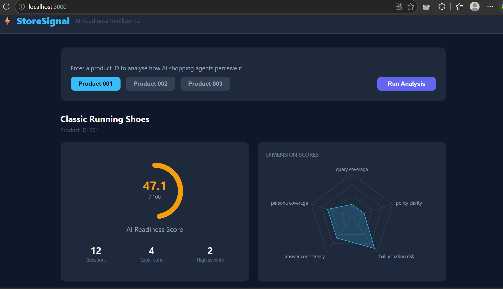
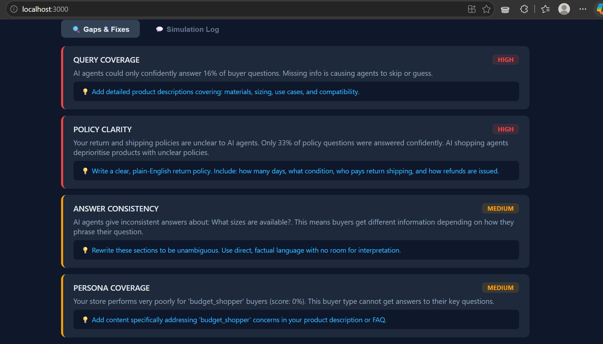
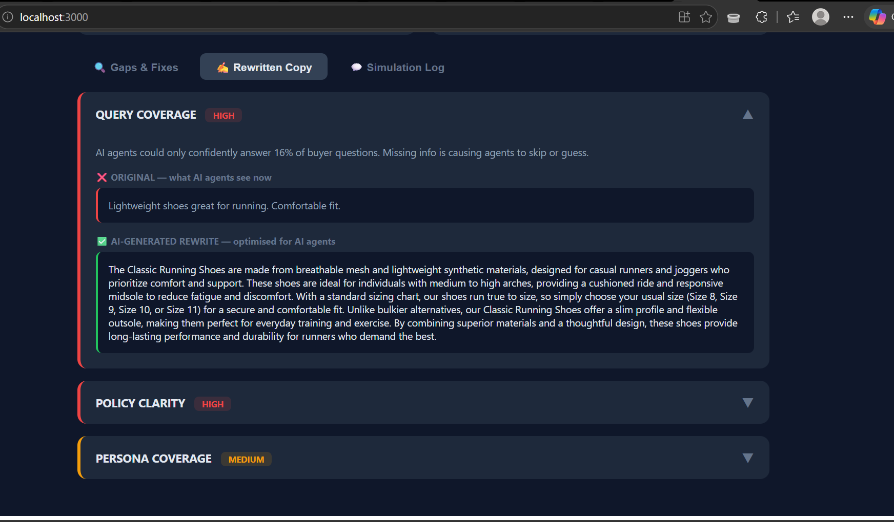

# ⚡ StoreSignal — AI Readiness Intelligence for Shopify

> Know exactly how AI shopping agents see your store — and fix it.

---

## The Problem

Shopping is shifting from search-and-browse to ask-and-decide.
ChatGPT, Google AI Mode, and Shopify's Agentic Plan now recommend
products directly inside conversations — without the buyer ever
clicking a link.

Merchants are getting traffic from these AI channels but have
**zero visibility** into how AI agents perceive their store.
A perfectly written listing can still be invisible to AI agents
because the description is ambiguous, the return policy is vague,
or basic buyer questions go unanswered.

**StoreSignal fixes this.**

---

## What It Does

StoreSignal simulates real AI buyer behaviour against your Shopify
store and tells you exactly where AI agents fail — and how to fix it.

### Core features

- 🤖 **AI simulation** — runs 12 buyer questions across 4 personas
  (budget shopper, gift buyer, first-time buyer, researcher)
- 📊 **5-dimension scoring** — query coverage, policy clarity,
  hallucination risk, answer consistency, persona coverage
- 🔍 **Drift detection** — asks the same question 5 ways to measure
  how consistently AI agents answer
- ⚠️ **Hallucination detection** — flags when AI agents invent
  information not present in your store data
- ✍️ **Copy rewriter** — generates AI-optimised rewrites for every
  gap found, ready to paste into Shopify

---

## Demo

> 📹 [Demo video link — add YouTube link here]

### Screenshots

**Score dashboard + dimension radar**


**Gap cards with severity and fixes**


**Before/after copy rewriter**


---

## Tech Stack

| Layer | Technology |
|-------|-----------|
| Backend | Python, FastAPI |
| AI simulation | Groq API (Llama 3.3 70B) |
| Frontend | React, Recharts |
| Data | Shopify Admin API |
| Schema | Pydantic |

---

## Project Structure

storesignal/
├── backend/
│   ├── main.py              # FastAPI server — 4 endpoints
│   ├── schema.py            # Shared data contracts
│   ├── ingestion/
│   │   ├── shopify.py       # Real Shopify API fetcher
│   │   └── mock_shopify.py  # Mock data for demo
│   ├── simulation/
│   │   └── agent.py         # AI simulation + drift detection
│   ├── scoring/
│   │   └── scorer.py        # Gap scoring + impact ranking
│   └── generation/
│       └── suggester.py     # LLM copy rewriter
├── frontend/
│   └── src/
│       └── App.js           # React dashboard
└── docs/
├── product_doc.md
├── technical_doc.md
└── decision_log.md

---

## Setup Instructions

### Prerequisites
- Python 3.10+
- Node.js 18+
- Groq API key (free at console.groq.com)
- Shopify Partner account + dev store (optional — mock data works)

### Backend

```bash
# 1. Clone the repo
git clone https://github.com/Praneetb2929/storesignal.git
cd storesignal/backend

# 2. Create virtual environment
python -m venv venv
venv\Scripts\activate        # Windows
# source venv/bin/activate   # Mac/Linux

# 3. Install dependencies
pip install -r requirements.txt

# 4. Create .env file
# Add these to backend/.env:
# GROQ_API_KEY=your_groq_key_here
# SHOPIFY_ACCESS_TOKEN=your_token (optional)
# SHOPIFY_STORE_URL=your-store.myshopify.com (optional)

# 5. Start the server
uvicorn main:app --reload --port 8000
```

Backend runs at `http://localhost:8000`
API docs at `http://localhost:8000/docs`

### Frontend

```bash
# In a new terminal
cd storesignal/frontend

# Install dependencies
npm install

# Start the app
npm start
```

Frontend runs at `http://localhost:3000`

---

## API Endpoints

| Method | Endpoint | Description |
|--------|----------|-------------|
| GET | `/` | Health check |
| GET | `/products` | List all product IDs |
| GET | `/analyse/{id}` | Full AI simulation + gap report |
| GET | `/fixes/{id}` | Gap report + AI copy rewrites |
| GET | `/product/{id}` | Product info |

---

## How It Works
Shopify store data
↓
ProductContext
↓
AI Simulator ──→ 4 personas × 3 questions = 12 simulations
↓
Drift Detector ──→ same question × 5 phrasings = consistency score
↓
Gap Scorer ──→ weighted score across 5 dimensions
↓
Copy Rewriter ──→ LLM rewrites for every gap found
↓
React Dashboard ──→ score, radar, gaps, before/after

---

## Contribution Note

**Praneet Biswal (Person A)** — AI simulation engine, drift detection,
hallucination detection, gap scorer, copy suggestion generator.
Led all ML/AI decision-making.

**Ayush Kumar (Person B)** — Shopify data ingestion, FastAPI server,
React dashboard. Led data pipeline and frontend.

Both contributed to: schema design, decision log, documentation,
testing, and product direction.

---

## Links

- 📹 Demo video: [add link]
- 🔗 Live demo: localhost (see setup above)
- 📄 Product document: [docs/product_doc.md](docs/product_doc.md)
- 📄 Technical document: [docs/technical_doc.md](docs/technical_doc.md)
- 📄 Decision log: [docs/decision_log.md](docs/decision_log.md)
